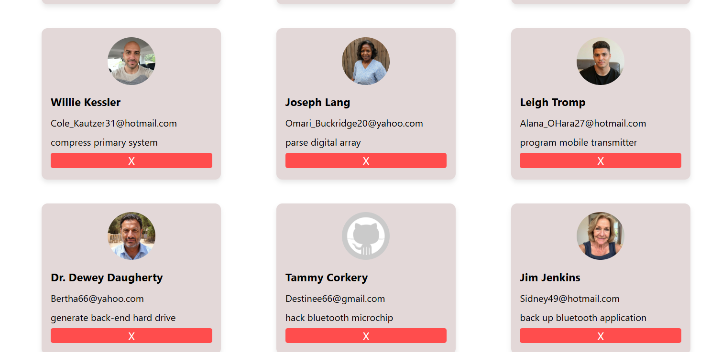
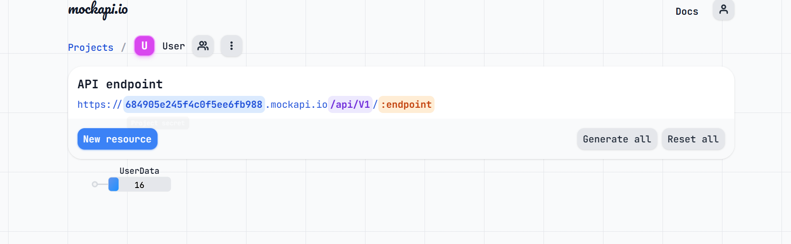

# User Data Fetcher

A simple web app to **fetch**, **display**, **add**, and **delete** user data using a mock API.  
Built with vanilla HTML, CSS, and JavaScript.

Api used = "https://684905e245f4c0f5ee6fb988.mockapi.io/api/V1/UserData"

Sites for Api = "https://mockapi.io/projects/684905e245f4c0f5ee6fb989"

---

## Features

- **Fetches users** from a public API and displays them as cards.
- **Add new users** interactively (prompts for name, email, message, and image).
- **Delete user cards** instantly from the UI.
- **Responsive** and easy to use.

---

## Demo





---

## How to Run

1. **Clone this repo**  
   ```sh
   git clone https://github.com/m-sam24/Fetch-data.git
   cd Fetch-data

